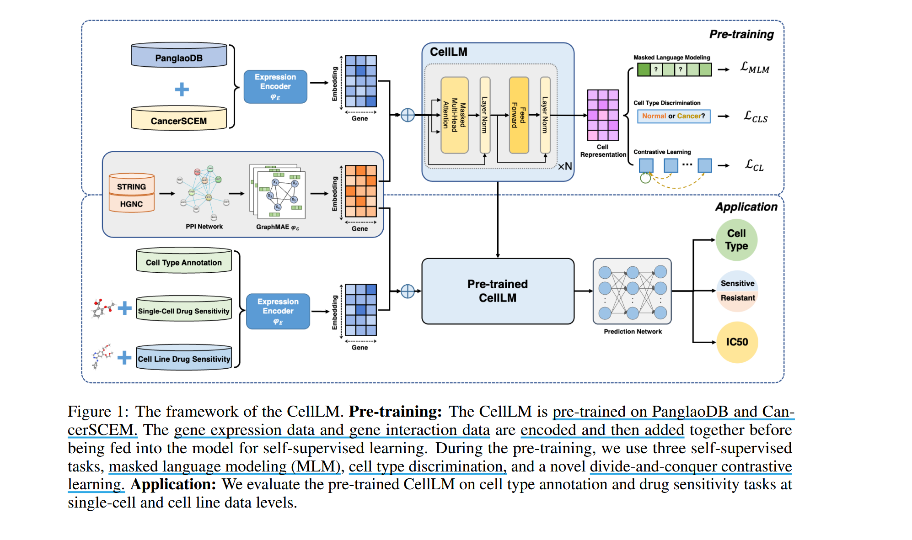
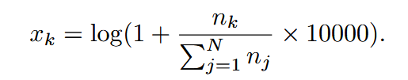
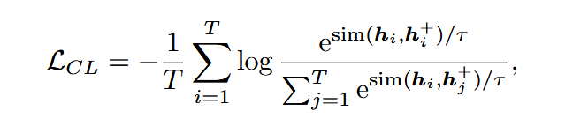
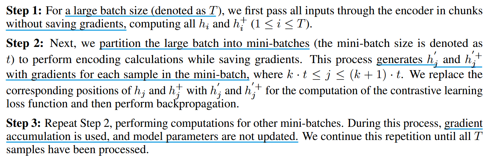
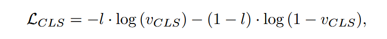
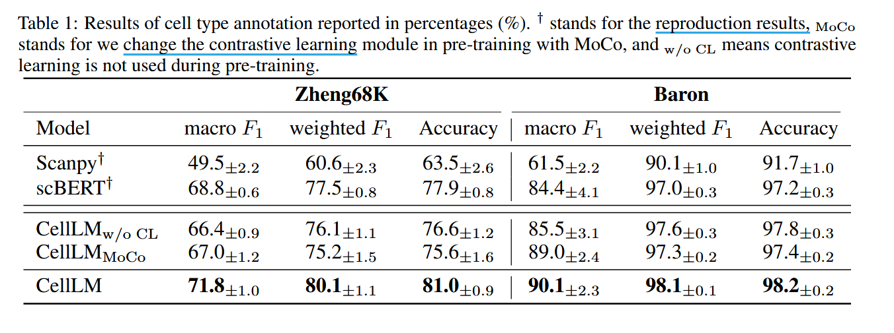
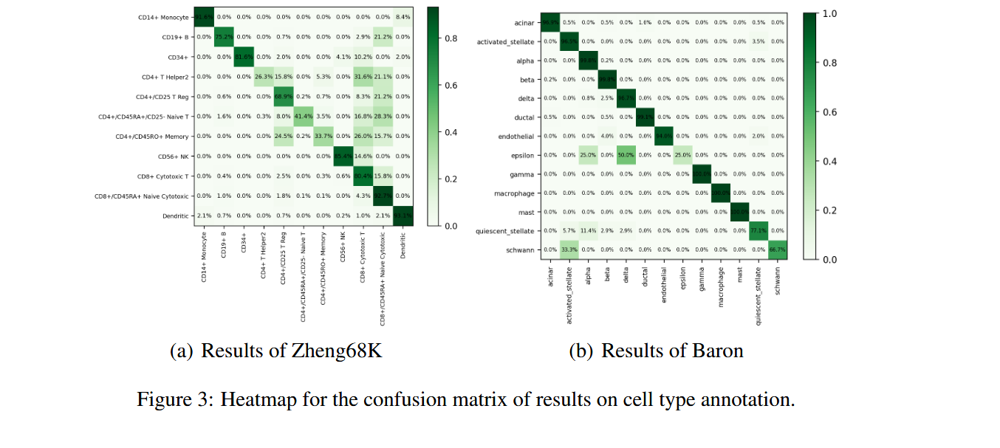
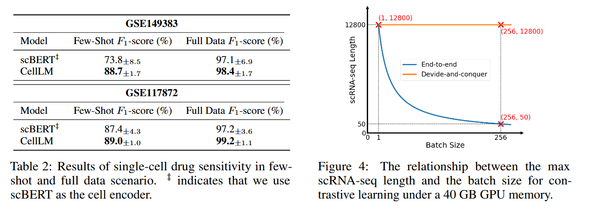
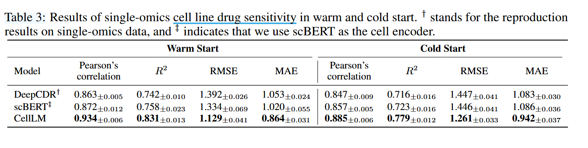

# Lagre-Scale Cell Representation Learining via Divide-and-Conquer Contrastive Learning

## Introduction

现有方法仅依赖于 BERT 架构进行细胞表示，研究表示由于嵌入空间的各向异性，直接应用 BERT 可能会导致其表示质量下降。具体来讲，一方面，低频词在预训练过程中没有得到有效的训练，导致其嵌入向量在特征空间中稀疏分布；另一方面，训练好的高频词的嵌入向量在特征空间上倾向于聚类。嵌入空间的**不均匀分布**限制了高频词和低频词之间的语义关联能力。

同样由于 scRNA-seq 数据显示出不同的基因表达频率，这表明 BERT 架构的缺点将延续到 scRNA-seq 数据的语义表示过程中。

对比学习通过学习正负样本特征来均匀分布嵌入，解决了各向异性问题。但对比学习一个基本挑战在于确保每个训练批次中有足够数量的负样本，这对于模型学习有效特征至关重要，但 GPU 显存大小加剧了这一挑战。

Memory bank 方法通过维护不涉及梯度反向传播的大量负样本队列来扩大负样本数量，但这种方法导致正负样本编码器的异步更新，不仅导致样本之间的差异，而且导致编码器之间的差异，从而导致训练不稳定。MoCo 提出一种动量编码器来缓解内存库中负编码器和正编码器之间的不一致更新。但与端到端对比学习方法相比，MoCo 只减少了编码器的异步更新，事实上正负样本的嵌入仍然是由不同的编码器产生的。

提出一种新的分而治之的对比学习方法（divide-and-conquer contrastive learning）去解耦批次和 GPU 显存。具体通过将一个大批次分为几个小批次计算后再更新梯度。

基于此，构建了 Single-**Cell** **L**anguage **M**odel(**CellLM**)，CellLM 是一种大规模细胞表示学习模型，用于处理包含 19,379 个基因的高维 scRNA-seq 数据，并且 CellLM 是首次尝试从正常细胞和癌细胞中学习的模型。由于单细胞数据稀疏性，我们动态地将基因与表达结合来减少预训练的计算负荷，而不是使用全长基因序列。


## Method



### Pre-Processing of scRNA-seq Data

RNA 原始数据以计数矩阵的形式提供，表示为 $M = {n_k}_{k=1}^{N}$，N 代表基因的数量， $n_k$ 为整数，表示 scRNA-seq 中第 $k$ 个基因的计数。由于批次效应，不同测序批次的数据间大小不具有可比性，将每一个数据归一化为



鉴于单细胞 RNA 测序数据具有高维度和高度稀疏的特点，我们只提取每个细胞中非零表达基因的位置索引 $P=\{p_k\}={j|x_j \in \mathcal{X} and x_j \neq 0}$ 以及其对应的表达值 $Y={y_k}={x_{p_k}}$，从而显著减少了训练时的计算开销（减少超过 70%）。

### Model Architecture

**Expression encoder $\varphi_E$**：由于基因表达水平是通过计数矩阵的归一化得到的，实际上在每个细胞中是离散的。根据表达式级别将其划分为几个 bin，并将每个 bin 映射为可训练的 512-dimensional 编码。

**Gene Encoder $\varphi_G$**：Protein-protein interaction(PPI) network 可以反映基因间的相互关系。所以使用 GraphMAE 去获得基因嵌入来作为额外知识。

**Performer-based module**：对输入矩阵 $C = (c_k)$ 送入 Performer 之前由两部分组成：gene embedding $\varphi_{G}(p_k)$ 和 expression embedding $\varphi_{E}(y_k)$。然后通过 Performer model 得到编码 $H = (h_k)$

``` math

c_k = \varphi_{G}(p_k) + \varphi_{E}(y_k)   

\$

H = Performer(C)

```

### Pre-training CellLM

设计了三个自监督学习方式：

**Divide-and-Conquer Contrastive Learning**





**Masked Language Modeling**: 


**Cell Type Discrimination**：把一个 [cls] 标签加到单细胞基因表达序列的开始，该位置的输出用于预测细胞是来自肿瘤组织还是正常组织。



## Experiments 

**Pre-training data**：在 2 million scRNA-seq 数据，来自 PanglaoDB 和 CancerSCEM 数据集。利用了 PanglaoDB 数据集包含来自 74 种人类组织的 1,126,580 单细胞数据点和 CancerSCEM 中来自 208 个癌症样本的 638,341 个单细胞数据点。

**Downstream tasks**: 
1. 在人外周血单核细胞数据集 Zheng68k 和胰腺数据集 Baron 进行细胞类型注释。





2. 在单细胞和细胞系水平上进行药物敏感性预测，即通过基因表达值预测是否对药物敏感。

> 细胞系 (cell line)：细胞系是指在体外培养条件下，来源于单一组织或细胞，可以连续传代，并在多个代次中保持相对稳定形态和功能的一组细胞群体。
>
> 细胞系药物敏感性预测：给定某个药物和某个细胞系，预测这个药物对该细胞系的敏感程度。敏感程度越高，说明药物越容易抑制该细胞的成长。

对单细胞任务，在人肺癌细胞（GSE149383）和人口腔癌细胞（GSE117872）两个数据集上进行了全场景（80% 训练）和少场景（5% 训练）实验。



对细胞系水平，使用 CCLE 和 GDSC 数据集进行评估，模拟冷启动和热启动。热启动情景，数据被随机分为 train、validation、test。冷启动场景中测试集中包含训练时没见过的细胞系。

> IC50(半数抑制浓度)：对一个细胞系施加不同浓度的药物，然后测量该细胞系的存活率或生长情况，最终得到一个连续值指标。



 

## TODO 

1. Expression encoder 中划分 bin 的方式
2. 对比学习代码实现
3. 模型嵌入以及 GraphMAE 实现

1-6  31、32

