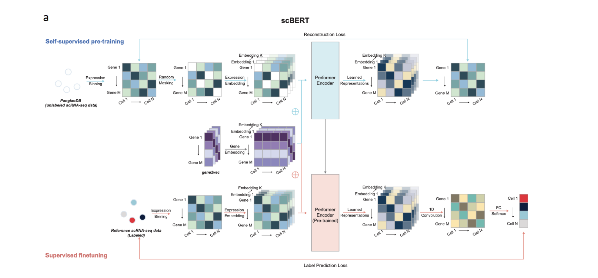
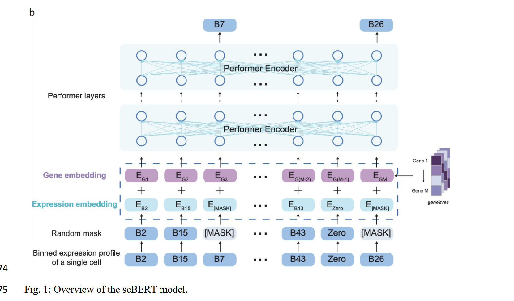

# scBERT: a Large-scale Pretrained Deep Langurage Model for Cell Type Annotation of Single-cell RNA-seq Data

## What are the current methods available for cell type annotation?

- annotation usiong marker gene sets, eg: culster-then-annotate

- correlation-based methods

- annotation by supervised classification

> marker gene : 只在某类细胞中特异性高表达的基因，可以用来区分不同类型的细胞。
> 

## What challenges are encountered by the aforementioned three methods?

**cluster-then-annotate**: 从文献和 scRNA-seq 数据集中鉴定的人工标记 marker gene 用于为无监督学习的每个簇分配细胞类型

- 人工挑选 marker genes，可能会引入偏差

- 一些细胞类型可能没有 marker gene sets，且记录良好的标记基因也并不是在所有相应的细胞中都有高表达

- 大多数细胞类型是由一组基因决定而不是一个 marker gene

**correlation-based methods**：基于相关性的方法测量查询样本于参考数据集之间基因表达图谱的相关性

- 受跨平台、跨实验批处理效应的影响，虽有处理的方法，但将生物多样性因素和计数差异区分开仍很困难

- 常用的相似度度量对于度量两组高维稀疏的数据并不鲁棒和有效

**annotation by supervised/semi-supervised classification**: 对噪声和可变的数据更稳健，且于 marker gene 选择独立

- 受模型容量限制，在将数据输入分类器之前须进行 highly-variable-gene(HVG) 选择和数据降维，但 HVGs 受批次效应影响，数据降维会丧失部分高维信息

- HVGs 和 PCA 参数设置没有统一的标准，人为设定会引入额外的偏差

- HVGs 是根据整个数据集的表达差异来选择，有忽略罕见细胞类型的关键基因的风险，此外仅考虑 HVGs 会忽略基因的共发生（co-occurence）和生物相互作用，这些在细胞类型注释方面是有用的

> HVG selection : 高变异基因筛选，从所有基因中选出在细胞群体间变异性较大的一部分基因

##  What are the strengths of the method presented in this paper?

## Method

如果没有细胞类型具有显著高概率，查询的细胞被标记为 “unknown”

与 BERT 相比

- 把位置嵌入换成 gene embedding 以注入 gene-gene interaction information, gene embedding 从 pre-trained gene2vec 获得

- 把词嵌入换成 expression embedding 通过将基因表达值分箱

- 把 BERT 中 Transformer 换成 Performer 

## Evaluating cell type annotation performance and robustness by intra-dataset cross validation.

## Cell type annotation across scRNA-seq datasets from different experiments.

## Discovery of novel cell types in the query dataset.

