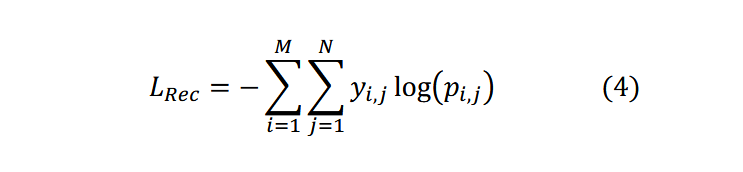

# scBERT: a Large-scale Pretrained Deep Langurage Model for Cell Type Annotation of Single-cell RNA-seq Data

## What are the current methods available for cell type annotation?

- annotation usiong marker gene sets, eg: culster-then-annotate

- correlation-based methods

- annotation by supervised classification

> marker gene : 只在某类细胞中特异性高表达的基因，可以用来区分不同类型的细胞。
> 

## What challenges are encountered by the aforementioned three methods?

**cluster-then-annotate**: 从文献和 scRNA-seq 数据集中鉴定的人工标记 marker gene 用于为无监督学习的每个簇分配细胞类型

- 人工挑选 marker genes，可能会引入偏差

- 一些细胞类型可能没有 marker gene sets，且记录良好的标记基因也并不是在所有相应的细胞中都有高表达

- 大多数细胞类型是由一组基因决定而不是一个 marker gene

**correlation-based methods**：基于相关性的方法测量查询样本于参考数据集之间基因表达图谱的相关性

- 受跨平台、跨实验批处理效应的影响，虽有处理的方法，但将生物多样性因素和计数差异区分开仍很困难

- 常用的相似度度量对于度量两组高维稀疏的数据并不鲁棒和有效

**annotation by supervised/semi-supervised classification**: 对噪声和可变的数据更稳健，且于 marker gene 选择独立

- 受模型容量限制，在将数据输入分类器之前须进行 highly-variable-gene(HVG) 选择和数据降维，但 HVGs 受批次效应影响，数据降维会丧失部分高维信息

- HVGs 和 PCA 参数设置没有统一的标准，人为设定会引入额外的偏差

- HVGs 是根据整个数据集的表达差异来选择，有忽略罕见细胞类型的关键基因的风险，此外仅考虑 HVGs 会忽略基因的共发生（co-occurence）和生物相互作用，这些在细胞类型注释方面是有用的

> HVG selection : 高变异基因筛选，从所有基因中选出在细胞群体间变异性较大的一部分基因

##  What are the strengths of the method presented in this paper?

## Method

如果结果中没有细胞类型具有显著高概率，查询的细胞被标记为 “unknown”

与 BERT 相比

- 把位置嵌入换成 gene embedding 以注入 gene-gene interaction information, gene embedding 从 pre-trained gene2vec 获得

- 把词嵌入换成 expression embedding 通过将基因表达值分箱

- 把 BERT 中 Transformer 换成 Performer 

## Evaluating cell type annotation performance and robustness by intra-dataset cross validation.

在 6 个 scRNA-seq 数据集上评估，应用 5 重交叉验证策略并重复 5 次以消除随机性影响

比较不同方法在细胞水平和细胞类型水平上的细胞类型注释，分别使用 accuracy 和 macro F1 score。

为研究下 reference dataset 对 scBERT 性能的影响，从 Zheng 68K dataset 均匀采样从 10% 到 90% 

观察到基于机器学习方法性能能受益于参考数据集规模的增加。

接着测试在细胞分布严重不均衡时，scBERT 的鲁棒性，从 Zheng68K 数据集中选 4 中 PBMC cell types，进行类别不平衡测试。

- 微调时，从四种细胞类型随机采样 10000, 100, 10000, 100 作为 reference data，推理时，每种类型采样 100 个细胞

## Cell type annotation across scRNA-seq datasets from different experiments.

leave-one-dataset-out strategy: （留一数据集法）一种常见的交叉验证（cross-validation）策略，主要用于评估模型的泛化能力，也适用于数据集间存在批次效应的场景。

原理：有 N 个数据集，每一轮验证中，挑选一个数据集作为测试集，其余 N - 1 个数据集合并作为训练集，重复 N 次，每次轮流将每个数据集留作测试集，其他所有数据集用来训练。

## Discovery of novel cell types in the query dataset.

参考数据集中存在的细胞类型可能无法覆盖所有的细胞类型，为检验 scBERT 在发现 unseen cell type 能力，在 MacParland dataset （训练时删掉一些细胞群） 上评估 scBERT 表现。

## Investigating scBERT model interpretability

进行可解释性分析去探索 key genes for decision-making。

- 将 multi-head multi-layer performers 注意力矩阵逐元素平均为一个注意力矩阵，这个矩阵 A(i, j) 代表着 gene i 给予 gene j

- 在对注意力矩阵的每列求和得到 attention-sum vector

- 这样可以得到与特定细胞类型相对应的 top attention gene

采用 Muraro dataset 进行实验：

- 找到最受欢迎的基因包括已经被研究的 markers of specific cell types

- 找到差异表达基因，有文献佐证可能是未发现的 marker gene

> enrichment analysis：富集分析，

 
## Methods

### The scBERT model

**Gene embedding** ：输入数据由 individual gene 和表达基因之间的相似性的 a predefined vector space （使用 gene2vec）

**Expression embedding** :  通过频率分析，将连续表达变量分词并转换为 200 维变量
> 在文本分析中，一个词在文本中出现的频率是非常有价值的信息，这种信息通常被转换为 “词袋模型（bag-of-words）” 的形式，以统计词频（term frequency）的方式实现，这种基于词频的表示方法，常被用于 NLP 领域的后续任务。

**Model Building** : 由于 scRNA-seq 维度可高达 20,000 ，采用 Transformer 的矩阵分解版本 Performer。构建模型使用 6 个 Performer encoder layers ，每层 10 个 head。

**Self-supervised learning on unlabeled data** : 由于 "dropout zeros" 现象，只随机 mask non-zero gene expression，进行预测。（注意由于分箱，相当于是分类任务而不是回归任务）

> dropout zeros phenomeno ：在单细胞转录组（scRNA-seq）测序数据种，会看到很多基因在某些细胞里的表达值为 0，这些 “0” 并不一定是真的没表达，可能由技术原因没被检测到，这种现象称为 dropout。

**Supervised learning on specific tasks** : scBERT 输出是 200-dimension feature 对应于每个基因，先采用以为卷积，再用 3-layer neural network 作为分类头。采用交叉熵损失函数作为预测损失。

### Datasets

两阶段使用不同来源的数据集，从而避免数据泄露。

**The Panglao dataset** : 整合了包含 74 个组织的 209 个人类单细胞数据集，共有 1,126,580 个细胞，来自不同平台不同实验，用于第一阶段预训练。只是用基因和表达水平。

**Zheng68k dataset** : 包含 68,000 个细胞，包含罕见的细胞类型和不平衡的细胞类型分布。用于 cell type annotation。

**Pancreas dataset** : 

**McParland dataset** : 

### Data preprocessing

数据以基因表达矩阵的形式提供，对数据进行了 log 归一化，使用 10,000 作为 "size factor"，对数据进行质量控制，过滤掉了哪些表达基因数少于 200 个的异常细胞
> 基因表达矩阵 ：每一行代表一个细胞，每一列代表一个基因，矩阵里的数据表示每个基因在每个细胞里的表达量

对输入到 scBERT 模型的数据，没有做降维或高变异基因筛选，因为 scBERT 能直接处理包含超过 2 万个基因的高维输入数据。

### Benchmarking

 

