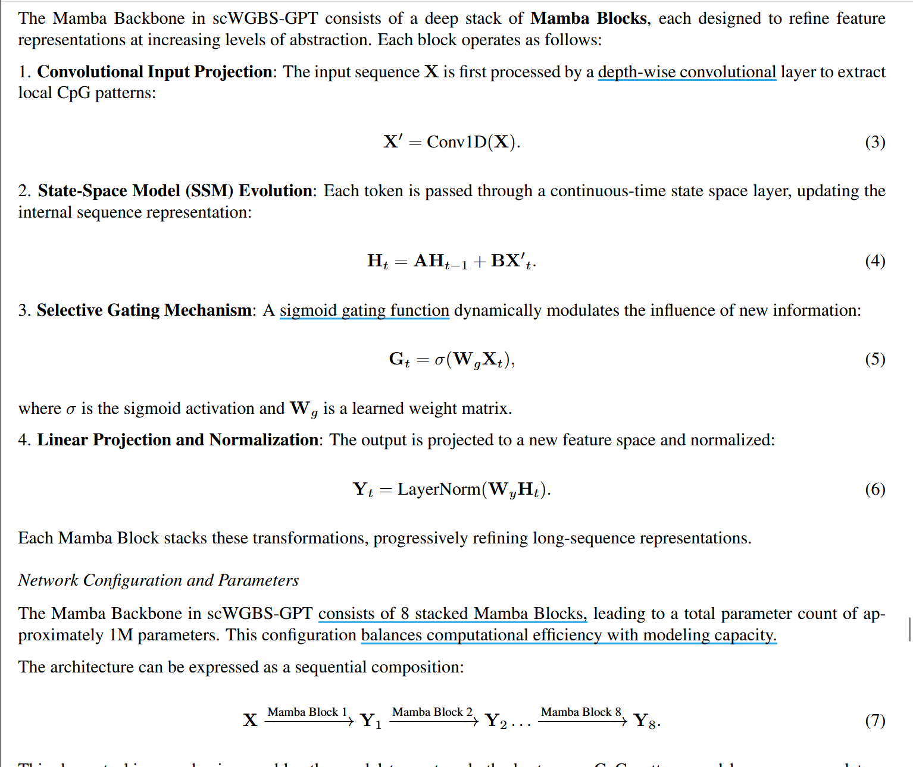

# scWGBS-GPT Note
## 

##

## Discussion
### What is scWGBS-GPT ?
- 第一个专门为单细胞 DNA 甲基化分析设计的大语言模型 （单细胞水平）
- 使用 mamba 架构具有 100 万个参数，整合交叉注意力机制 
- 在超过 100 万个单细胞甲基化数据上训练

 
### What are scWBGS-GPT's advantages ?
- cluster 和 cell type prediction 实现很高的精度
- 具有可解释性，注意力权重越高区域对应低 DNA 甲基化比率
- 在重建细胞分化轨迹方面展现出很高的能力

> cluster （聚类）: 根据细胞在某些特征（如基因表达、甲基化模式）上的相似性，自动将细胞分组，每一组就是一个“簇（cluster）” 
>
> cell type prediction （细胞类型预测）：给定某个细胞的表达或甲基化等特征，预测它属于哪一种已知的细胞类型
>
> cell differentiation trajectory （细胞分化轨迹）: 在个体发育或组织重建过程中，细胞从未分化状态逐渐转变为特定功能类型细胞的过程路径
>

### What are scWGBS-GPT's future ?
- 预训练数据集主要来自脑部，使用 cfDNA 解卷积推断细胞类型会带来很大局限性，不能很好捕获其他组织或器官的特征
- 仅使用甲基化数据，希望能整合其他组学信息（eg: scRNA-seq,scHi-C,...）
- 希望整合更多个体信息，增强在个体水平预测能力
  
> cell-free DNA (cfDNA) : 无细胞 DNA，游离在体液中的 DNA 片段，不是来自完整的细胞 
>
> deconvolution （去卷积/解卷积）: 在生物信息学中，去卷积指从一个混合信号中，反推出各个成分及其比例
>

## METHOD  -- Model

### scWGBS Tokenizer
**core** : 将 DNA 序列看成一串 "CpG"，每个 CpG 是一个 token，并将 flanking nucleotide contect 当作上下文信息整合到 token

**process** :
1. DNA 序列拆分 ： 将基因组数据拆分成 CpG 位点窗口，每个窗口都包含一系列 CpG 位点序列，周围的核苷酸作为上下文进行编码
2. 甲基化状态编码 : 对窗口中每一个 CpG 进行编码，甲基化状态二值化并整合周围 k-mer 
3. 序列组装 ：将上述每个 CpG 的 token（每个是一个向量）组装成一个 “token序列”
4. 特殊 token 插入 : \[BOS\] 插入到窗口开始，\[SEP\] 插入到窗口末尾，用于生成 cross-attention 查询向量

for example :  

$$ Genomic Window = \[x_1, x_2, ..., x_n \] $$   

through tokenizer processes :   

$$ Tokenized Sequence = \[\[BOS\], t_1, t_2, ..., t_n, \[SEP\]\]$$ 

**advantages**
1. 保留甲基化信息
2. contextualized tokenization : 包含侧翼核苷酸使得保留了上下文信息
3. 可扩展性

> **flanking nucleotides（侧翼碱基）** : 指某个特定位点上下游附近的碱基序列
> 
> **k-mer** ：在一个生物序列（如 DNA 序列）中，连续的 k 个碱基构成的子串叫做一个 k-mer
>

### Mamba Backbone

**motivation** : 由于scWGBS（单细胞全基因组亚硫酸氢盐测序）数据超长序列，且需要对局部 CpG 相互作用和长程依赖性进行高效建模。而 mamba结构实现了线性复杂度的注意力机制并且能有效进行长序列建模  

### Cross Attention

**process** : 用 \[SEP\] token 的隐藏状态生成查询，每个 CpG 位点的隐藏状态生成键和值，做交叉注意力，得到的 $H_{att}$ 用于下游层的进一步处理

**advantages** :
1. 捕获长程依赖关系
2. 将 CpG 位点间相互作用"上下文化"处理
3. 高效的表征学习，使得即使是不完整或稀疏的数据也能捕获有意义模式

